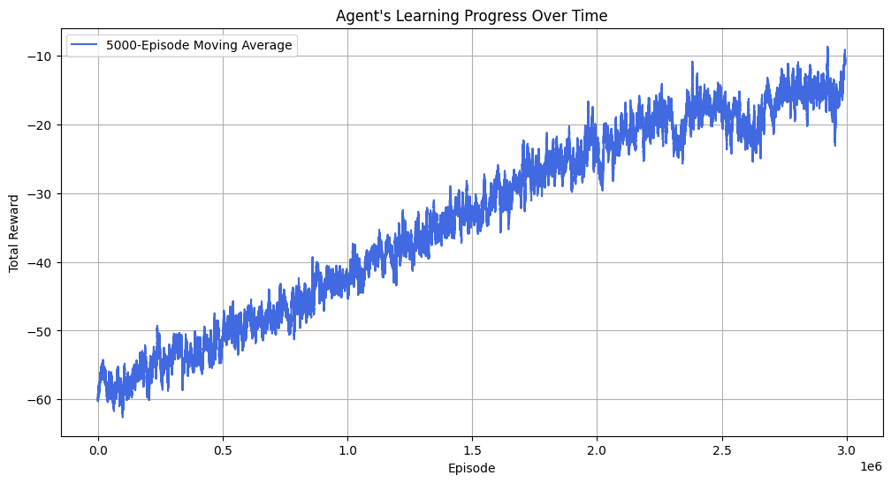
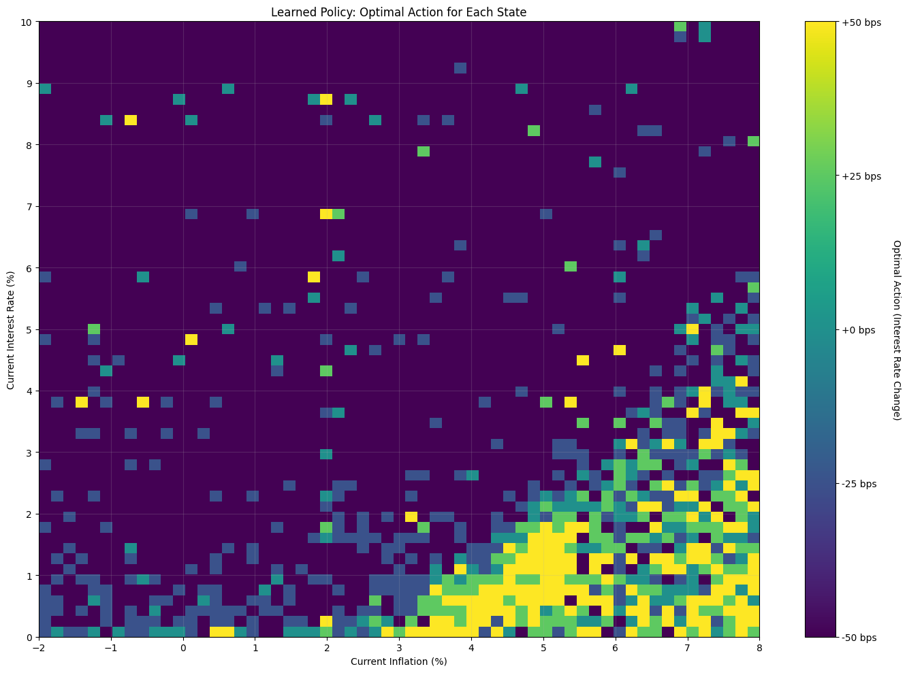

---
title: "Optimizing Monetary Policy with Q-Learning"
date: 2025-06-29T12:00:00-07:00   # original post date, keep this fixed
author: "Nima Nikopour"
lastmod: 2025-06-29T12:00:00-07:00  # update this when editing to show latest edit date
draft: false
---


Reinforcement learning provides a framework for solving dynamic optimization problems. This article offers a direct example of applying Q-learning to train an agent that conducts monetary policy in a simplified economic environment. This project is broken down into three core coding sections. I begin by defining the `EconomyEnv` class, which simulates the simplified economy and contains its fundamental rules, including the state variables (inflation, interest rate) and the agent's action space. Next, I build the `QLearningAgent` class, whose responsibility is to learn the optimal policy by updating its Q-table based on rewards. The final section brings these two together, managing the training process, hyperparameter settings, and the discretization of the continuous state space required for a tabular Q-learning approach.

### The Economic Model: A Simple World

The agent's universe is governed by a simplified Phillips Curve. This states that raising interest rates tends to lower future inflation, and vice-versa
<div>
$$\pi_{t+1} = \beta \pi_t - \sigma i_t + \epsilon_{t+1} $$
<div>
Here, future inflation $\pi_{t+1}$ is determined by current inflation $\pi_t$, the interest rate set by the agent $i_t$, and a random economic shock $\epsilon_{t+1}$. The agent's only tool to influence this world is the interest rate. Its goal is to keep inflation stable at a target of 2%.

### The Learning Problem: States, Actions, and Rewards

To teach the agent, I frame the task as a Markov Decision Process:

* **State ($S_t$):** What the agent observes. In this case it's the current inflation rate and interest rate: $(\pi_t, i_t)$.
* **Action ($A_t$):** The choices the agent can make. I give it five options: a large or standard rate cut, holding steady, or a standard or large rate hike.
* **Reward ($R_{t+1}$):** A feedback signal that tells the agent how well it's doing. I use a reward shaping technique where the agent is rewarded at every step for making progress towards the 2% inflation target.

### The Reward Function Specification

The objective of the agent is defined by its reward function. To provide continuous feedback and ensure stable learning, I use a dense reward signal composed of three primary components.

For any non-terminal step, the reward $R_{t+1}$ is specified as:

<div>
$$R_{t+1} = \left[ k \cdot (\text{error}_t - \text{error}_{t+1}^{\text{expected}}) \right] - \left[ \alpha \cdot (\Delta i_t)^2 \right]$$
<div>
    
The components are defined as follows:

* **Progress Component:** The primary term (the first set of brackets), incentivizes the agent to take actions that are expected to reduce the absolute error between inflation and the 2% target. The hyperparameter $k$ scales the magnitude of this incentive.

* **Volatility Penalty:** The term $[ \alpha \cdot (\Delta i_t)^2 ]$ adds a quadratic cost for large changes in the interest rate, promoting a smoother and more stable policy.

* **Terminal Rewards:** An episode concludes with a large terminal reward of `+100` for achieving the target state or a large penalty of `-100` if the agent's action leads to economic instability.


### Deriving the Reward Function

The objective of the agent is defined by its reward function. In many reinforcement learning problems, this is a **sparse reward** which is  a single outcome at the very end of a long episode, like a "win" or "loss." This makes it difficult for the agent to know which of its many actions were responsible for the result. To solve this, I use a **dense reward signal**, which provides informative feedback at every single time step.

I employ the technique of Potential-Based Reward Shaping. This method, formalized by Ng, Harada, and Russell (1999), provides a blueprint for adding dense, intermediate rewards while preserving the optimal policy of the original problem. This property, known as policy invariance, ensures that the guidance doesn't inadvertently teach the agent the wrong long-term strategy.

The technique requires defining a "potential function," $\phi(s)$, which assigns a scalar value to each state based on its desirability. For this problem, I define the potential as the negative scaled distance from the 2% inflation target:

$$\phi(s) = -k \cdot |\pi_s - \pi_{\text{goal}}|$$

$k$ is a scaling hyperparameter (set to 10 in my code) used to control the magnitude of the potential, which in turn amplifies the reward signal. A state closer to the goal has a higher potential (a less negative value). The policy-invariant shaping reward, $F$, is then derived from the change in this potential (setting discount factor $\gamma=1$ for the shaping term):

$$F(s, s') = \phi(s') - \phi(s)$$

By substituting the definition of $\phi(s)$, this yields the `reward_for_progress` term used in the code:

$$F = k \cdot \left( |\pi_t - \pi_{\text{goal}}| - |\pi_{t+1}^{\text{expected}} - \pi_{\text{goal}}| \right)$$

This shaping reward, $F$, acts as the primary guiding signal. However, the overall objective also includes a preference for policy stability. This is captured by a **policy volatility penalty**, $-\alpha (\Delta i_t)^2$. Note that this penalty is treated separately and is not part of the potential function. The technical reason is that a potential function $\psi(s)$ can, by definition, only be a function of the **state** ($s$). The interest rate change, $\Delta i_t$, is a direct consequence of the agent's action, not a feature of the state itself. Therefore, it mathematically cannot be included in $\psi(s)$.

This penalty, along with the terminal rewards (`+/- 100`), constitutes the "original" reward, $R_{original}$, which defines the fundamental constraints and objectives of the problem. The final reward given to the agent, $R_{total}$, is the sum of this true objective and the helpful shaping hint:
<div>
$$R_{\text{total}} = \underbrace{ \left[ k \cdot (\text{error}_t - \text{error}_{t+1}^{\text{expected}}) \right] }_{F: \text{The Policy-Invariant Hint}} + \underbrace{ \left( -\alpha (\Delta i_t)^2 \pm 100_{\text{if terminal}} \right) }_{R_{original}: \text{The True Objective}}$$
<div>


```python
import numpy as np
import gym
from gym import spaces
from gym.utils import seeding
import matplotlib.pyplot as plt

# ==============================================================================
# PART 1: THE ECONOMIC ENVIRONMENT
# ==============================================================================

class EconomyEnv(gym.Env):
    """
    A custom Gym environment simulating a simple economy based on the Phillips Curve.
    """
    metadata = {'render.modes': ['human']}

    def __init__(self,
                 inflation_persistence=1.0,
                 rate_sensitivity=0.2,
                 policy_change_cost=0.5,
                 max_episode_steps=100,
                 potential_scaling_factor=10
                ):
        super().__init__()

        # --- Economic Model Parameters ---
        self.beta = inflation_persistence    # How much past inflation affects current inflation
        self.sigma = rate_sensitivity      # How much interest rates affect inflation
        self.alpha = policy_change_cost      # Penalty for volatile policy changes
        self.kappa = potential_scaling_factor

        # --- Environment Configuration ---
        self.shock_std_dev = 0.5
        self.goal_inflation = 2.0
        self._max_episode_steps = max_episode_steps

        # --- State Space Boundaries ---
        self.min_inflation = -2.0
        self.max_inflation = 8.0
        self.min_interest_rate = 0.0  # Enforce the Zero Lower Bound (ZLB)
        self.max_interest_rate = 10.0 # 

        # --- Gym Setup ---
        self.state = None
        self._current_step = 0

        # Define observation space (a continuous range of values)
        obs_low = np.array([self.min_inflation, self.min_interest_rate], dtype=np.float32)
        obs_high = np.array([self.max_inflation, self.max_interest_rate], dtype=np.float32)
        self.observation_space = spaces.Box(low=obs_low, high=obs_high, dtype=np.float32)

        # Define action space (a discrete set of 5 actions)
        self.action_space = spaces.Discrete(5)
        self._action_map = {
            0: -50.0, # Large Cut
            1: -25.0, # Standard Cut
            2: 0.0,   # Hold
            3: 25.0,  # Standard Hike
            4: 50.0   # Large Hike
        }
        self.seed()

    def seed(self, seed=None):
        self.np_random, seed = seeding.np_random(seed)
        return [seed]

    def step(self, action):
        """Execute one time step within the environment."""
        current_inflation, current_interest_rate = self.state

        # --- Action ---
        # Map the discrete action (0-4) to a change in basis points
        bps_change = self._action_map[action]
        new_interest_rate = np.clip(
            current_interest_rate + (bps_change / 100.0),
            self.min_interest_rate,
            self.max_interest_rate
        )

        # --- Reward Calculation (via Reward Shaping) ---
        # This "dense" reward function guides the agent at every step.
        # 1. Calculate the deviation from the inflation target in the current state.
        current_deviation = np.abs(current_inflation - self.goal_inflation)

        # 2. Calculate the expected deviation in the next state.
        expected_next_inflation = (self.beta * current_inflation) - (self.sigma * new_interest_rate)
        next_deviation = np.abs(expected_next_inflation - self.goal_inflation)

        # 3. The primary reward is the *improvement* in deviation. A positive
        #    reward is given for getting closer to the target.
        reward_for_progress = self.kappa * (current_deviation - next_deviation)

        # 4. A small penalty is applied for making large, volatile policy changes.
        policy_penalty = self.alpha * (bps_change / 100.0)**2
        reward = reward_for_progress - policy_penalty

        # --- State Transition ---
        # The actual next state is the expected state plus a random economic shock.
        economic_shock = self.np_random.normal(0, self.shock_std_dev)
        new_inflation = expected_next_inflation + economic_shock

        self._current_step += 1

        # --- Terminal Conditions ---
        is_unstable = not (self.min_inflation <= new_inflation <= self.max_inflation)
        is_over_time = self._current_step >= self._max_episode_steps
        is_successful = bool(np.abs(new_inflation - self.goal_inflation) < 0.2)
        done = is_unstable or is_over_time or is_successful

        # Add large terminal rewards/penalties to strongly guide final outcomes.
        if is_unstable:
            reward -= 100.0
        if is_successful:
            reward += 100.0

        # Update the state and return results
        self.state = np.array([
            np.clip(new_inflation, self.min_inflation, self.max_inflation),
            new_interest_rate
        ], dtype=np.float32)

        return self.state, reward, done, {}

    def reset(self):
        """Reset the environment to a random initial state."""
        self._current_step = 0
        # Start each episode in a random valid state to ensure broad learning
        self.state = self.observation_space.sample()
        return self.state


```

### The Solution: Q-Learning

To solve this problem, I use the Q-learning algorithm. The goal is to learn a "quality" function, or **Q-function**, denoted as $Q(s, a)$. This function represents the agent's estimate of the total discounted future reward it can expect to receive by taking action $a$ from state $s$. Because our state space is discretized, these values are stored in a multi-dimensional array—in this case, a 3D table (inflation bin, interest rate bin, action)—called the Q-table.

To learn these Q-values, the agent must systematically explore its environment. It follows an **epsilon-greedy ($\epsilon$-greedy) policy** to balance two competing needs:

* **Exploration:** With a small probability, $\epsilon$, the agent takes a completely random action. This is critical for discovering new, potentially better strategies.
* **Exploitation:** With probability $1-\epsilon$, the agent chooses the action with the highest known Q-value for its current state, thereby exploiting its accumulated knowledge.

Initially, $\epsilon$ is set to 1.0 (100% exploration), and it is gradually decayed over the course of training, causing the agent to increasingly rely on the optimal policy it has learned.

After taking an action and observing the immediate reward, $R_{t+1}$, and the resulting state, $s'$, the agent updates its Q-table. This update is performed using the temporal-difference rule derived from the Bellman equation:

$$ Q_{new}(s, a) = Q_{old}(s, a) + \alpha \left[ R_{t+1} + \gamma \max_{a'} Q(s', a') - Q_{old}(s, a) \right] $$

This equation nudges the old Q-value toward a new, more accurate estimate:

* **$\alpha$ (Alpha):** The **Learning Rate**. A hyperparameter that controls how much new information overwrites old information.
* **$\gamma$ (Gamma):** The **Discount Factor**. It determines the present value of future rewards; a value close to 1 means the agent is patient and values long-term outcomes.
* **$R_{t+1} + \gamma \max_{a'} Q(s', a')$**: This is the **TD (Temporal-Difference) Target**. It represents our new, improved estimate for the value of being in state $s$ and taking action $a$. It is calculated from the immediate reward we just received ($R_{t+1}$) plus the discounted value of the best possible action from the next state ($s'$).


```python
# ==============================================================================
# PART 2: THE Q-LEARNING AGENT 
# ==============================================================================

class QLearningAgent:
    """A standard agent that learns via the Q-learning algorithm."""
    def __init__(self, state_bins, num_actions, alpha, gamma, epsilon):
        self.num_actions = num_actions
        self.alpha = alpha      # Learning rate: How much to update Q-values
        self.gamma = gamma      # Discount factor: Importance of future rewards
        self.epsilon = epsilon    # Exploration rate: Probability of taking a random action
        self.q_table = np.zeros(state_bins + (num_actions,))

    def choose_action(self, state_tuple):
        """Chooses an action using an epsilon-greedy policy."""
        if np.random.uniform(0, 1) < self.epsilon:
            # Exploration: Take a random action
            return np.random.choice(self.num_actions)
        else:
            # Exploitation: Choose the action with the highest Q-value
            q_values = self.q_table[state_tuple]
            return np.argmax(q_values)

    def update_q_table(self, state, action, reward, next_state):
        """Updates the Q-value for a state-action pair using the Bellman equation."""
        old_value = self.q_table[state][action]
        next_max = np.max(self.q_table[next_state])

        # The core of Q-learning
        new_value = old_value + self.alpha * (reward + self.gamma * next_max - old_value)
        self.q_table[state][action] = new_value
```

### Implementation: Discretization and Training

**State Space Discretization:** The economic environment is continuous, but a Q-table requires a finite number of states. I solve this by discretizing the state space, carving the continuous ranges of inflation and interest rates into a finite grid. An observed continuous state like `(inflation=2.17%, interest_rate=3.58%)` is then mapped to a specific cell in this grid (e.g., `[inflation_bin=21, interest_rate_bin=18]`). This grid forms the discrete states $s$ used to index the Q-table.

**Training Loop:** The agent is trained over millions of episodes to populate the Q-table. In each episode, the agent's exploration rate, $\epsilon$, is gradually decayed, shifting its behavior from random exploration to exploiting the optimal policy it has learned. The final output is the converged Q-table, which acts as the agent's complete policy map.


```python
# ==============================================================================
# PART 3: TRAINING AND VISUALIZATION
# ==============================================================================

def discretize_state(state, bins):
    """Converts a continuous state vector into a discrete tuple for Q-table indexing."""
    inflation_val, interest_rate_val = state
    # Find which bin each continuous value falls into
    inflation_bin = np.digitize(inflation_val, bins[0]) - 1
    interest_rate_bin = np.digitize(interest_rate_val, bins[1]) - 1

    # Clip values to ensure they are valid indices for the Q-table
    return (
        np.clip(inflation_bin, 0, len(bins[0]) - 2),
        np.clip(interest_rate_bin, 0, len(bins[1]) - 2)
    )

if __name__ == '__main__':
    # --- Hyperparameters ---
    NUM_EPISODES = 3_000_000
    NUM_INFLATION_BINS = 30
    NUM_INTEREST_BINS = 40
    LEARNING_RATE = 0.1
    DISCOUNT_FACTOR = 0.99
    EPSILON_START = 1.0
    EPSILON_END = 0.01
    # Epsilon decays over the first 80% of episodes
    EPSILON_DECAY_RATE = (EPSILON_START - EPSILON_END) / (NUM_EPISODES * 0.8)

    # --- Initialization ---
    env = EconomyEnv()
    state_discretization_bins = [
        np.linspace(env.min_inflation, env.max_inflation, NUM_INFLATION_BINS),
        np.linspace(env.min_interest_rate, env.max_interest_rate, NUM_INTEREST_BINS)
    ]
    q_table_shape = (NUM_INFLATION_BINS - 1, NUM_INTEREST_BINS - 1)

    agent = QLearningAgent(
        state_bins=q_table_shape,
        num_actions=env.action_space.n,
        alpha=LEARNING_RATE,
        gamma=DISCOUNT_FACTOR,
        epsilon=EPSILON_START
    )

    rewards_per_episode = []
    print("--- Starting Training ---")

    # --- Training Loop ---
    for episode in range(NUM_EPISODES):
        state_continuous = env.reset()
        state_discrete = discretize_state(state_continuous, state_discretization_bins)
        done = False
        total_episode_reward = 0

        while not done:
            action = agent.choose_action(state_discrete)
            next_state_continuous, reward, done, _ = env.step(action)
            next_state_discrete = discretize_state(next_state_continuous, state_discretization_bins)
            agent.update_q_table(state_discrete, action, reward, next_state_discrete)
            state_discrete = next_state_discrete
            total_episode_reward += reward

        # Decay epsilon after each episode
        if agent.epsilon > EPSILON_END:
            agent.epsilon -= EPSILON_DECAY_RATE

        rewards_per_episode.append(total_episode_reward)

        # Print progress update periodically
        if (episode + 1) % 50000 == 0:
            avg_reward = np.mean(rewards_per_episode[-5000:])
            print(f"Episode: {episode + 1:>7}/{NUM_EPISODES} | Avg Reward (last 5k): {avg_reward:8.2f} | Epsilon: {agent.epsilon:.4f}")

    print("--- Training Finished ---")


```

<details>
<summary>Show Training Logs</summary>

    --- Starting Training ---
    Episode:   50000/3000000 | Avg Reward (last 5k):   -58.46 | Epsilon: 0.9794
    Episode:  100000/3000000 | Avg Reward (last 5k):   -55.27 | Epsilon: 0.9587
    Episode:  150000/3000000 | Avg Reward (last 5k):   -53.38 | Epsilon: 0.9381
    Episode:  200000/3000000 | Avg Reward (last 5k):   -55.71 | Epsilon: 0.9175
    Episode:  250000/3000000 | Avg Reward (last 5k):   -54.15 | Epsilon: 0.8969
    Episode:  300000/3000000 | Avg Reward (last 5k):   -54.91 | Epsilon: 0.8762
    Episode:  350000/3000000 | Avg Reward (last 5k):   -54.84 | Epsilon: 0.8556
    Episode:  400000/3000000 | Avg Reward (last 5k):   -54.10 | Epsilon: 0.8350
    Episode:  450000/3000000 | Avg Reward (last 5k):   -53.69 | Epsilon: 0.8144
    Episode:  500000/3000000 | Avg Reward (last 5k):   -53.29 | Epsilon: 0.7937
    Episode:  550000/3000000 | Avg Reward (last 5k):   -51.78 | Epsilon: 0.7731
    Episode:  600000/3000000 | Avg Reward (last 5k):   -48.55 | Epsilon: 0.7525
    Episode:  650000/3000000 | Avg Reward (last 5k):   -50.17 | Epsilon: 0.7319
    Episode:  700000/3000000 | Avg Reward (last 5k):   -47.55 | Epsilon: 0.7112
    Episode:  750000/3000000 | Avg Reward (last 5k):   -50.07 | Epsilon: 0.6906
    Episode:  800000/3000000 | Avg Reward (last 5k):   -45.87 | Epsilon: 0.6700
    Episode:  850000/3000000 | Avg Reward (last 5k):   -46.32 | Epsilon: 0.6494
    Episode:  900000/3000000 | Avg Reward (last 5k):   -41.20 | Epsilon: 0.6287
    Episode:  950000/3000000 | Avg Reward (last 5k):   -42.94 | Epsilon: 0.6081
    Episode: 1000000/3000000 | Avg Reward (last 5k):   -43.61 | Epsilon: 0.5875
    Episode: 1050000/3000000 | Avg Reward (last 5k):   -45.70 | Epsilon: 0.5669
    Episode: 1100000/3000000 | Avg Reward (last 5k):   -40.52 | Epsilon: 0.5462
    Episode: 1150000/3000000 | Avg Reward (last 5k):   -39.68 | Epsilon: 0.5256
    Episode: 1200000/3000000 | Avg Reward (last 5k):   -40.72 | Epsilon: 0.5050
    Episode: 1250000/3000000 | Avg Reward (last 5k):   -38.01 | Epsilon: 0.4844
    Episode: 1300000/3000000 | Avg Reward (last 5k):   -35.41 | Epsilon: 0.4637
    Episode: 1350000/3000000 | Avg Reward (last 5k):   -31.66 | Epsilon: 0.4431
    Episode: 1400000/3000000 | Avg Reward (last 5k):   -35.64 | Epsilon: 0.4225
    Episode: 1450000/3000000 | Avg Reward (last 5k):   -30.22 | Epsilon: 0.4019
    Episode: 1500000/3000000 | Avg Reward (last 5k):   -32.97 | Epsilon: 0.3812
    Episode: 1550000/3000000 | Avg Reward (last 5k):   -32.01 | Epsilon: 0.3606
    Episode: 1600000/3000000 | Avg Reward (last 5k):   -32.68 | Epsilon: 0.3400
    Episode: 1650000/3000000 | Avg Reward (last 5k):   -30.51 | Epsilon: 0.3194
    Episode: 1700000/3000000 | Avg Reward (last 5k):   -29.57 | Epsilon: 0.2987
    Episode: 1750000/3000000 | Avg Reward (last 5k):   -25.22 | Epsilon: 0.2781
    Episode: 1800000/3000000 | Avg Reward (last 5k):   -27.00 | Epsilon: 0.2575
    Episode: 1850000/3000000 | Avg Reward (last 5k):   -25.29 | Epsilon: 0.2369
    Episode: 1900000/3000000 | Avg Reward (last 5k):   -23.25 | Epsilon: 0.2162
    Episode: 1950000/3000000 | Avg Reward (last 5k):   -22.05 | Epsilon: 0.1956
    Episode: 2000000/3000000 | Avg Reward (last 5k):   -28.22 | Epsilon: 0.1750
    Episode: 2050000/3000000 | Avg Reward (last 5k):   -19.97 | Epsilon: 0.1544
    Episode: 2100000/3000000 | Avg Reward (last 5k):   -22.47 | Epsilon: 0.1337
    Episode: 2150000/3000000 | Avg Reward (last 5k):   -21.62 | Epsilon: 0.1131
    Episode: 2200000/3000000 | Avg Reward (last 5k):   -18.51 | Epsilon: 0.0925
    Episode: 2250000/3000000 | Avg Reward (last 5k):   -17.62 | Epsilon: 0.0719
    Episode: 2300000/3000000 | Avg Reward (last 5k):   -14.52 | Epsilon: 0.0512
    Episode: 2350000/3000000 | Avg Reward (last 5k):   -22.56 | Epsilon: 0.0306
    Episode: 2400000/3000000 | Avg Reward (last 5k):   -15.22 | Epsilon: 0.0100
    Episode: 2450000/3000000 | Avg Reward (last 5k):   -16.36 | Epsilon: 0.0100
    Episode: 2500000/3000000 | Avg Reward (last 5k):   -21.82 | Epsilon: 0.0100
    Episode: 2550000/3000000 | Avg Reward (last 5k):   -18.83 | Epsilon: 0.0100
    Episode: 2600000/3000000 | Avg Reward (last 5k):   -17.20 | Epsilon: 0.0100
    Episode: 2650000/3000000 | Avg Reward (last 5k):   -14.62 | Epsilon: 0.0100
    Episode: 2700000/3000000 | Avg Reward (last 5k):   -12.12 | Epsilon: 0.0100
    Episode: 2750000/3000000 | Avg Reward (last 5k):   -14.64 | Epsilon: 0.0100
    Episode: 2800000/3000000 | Avg Reward (last 5k):   -13.53 | Epsilon: 0.0100
    Episode: 2850000/3000000 | Avg Reward (last 5k):   -10.35 | Epsilon: 0.0100
    Episode: 2900000/3000000 | Avg Reward (last 5k):   -13.32 | Epsilon: 0.0100
    Episode: 2950000/3000000 | Avg Reward (last 5k):   -19.52 | Epsilon: 0.0100
    Episode: 3000000/3000000 | Avg Reward (last 5k):   -14.81 | Epsilon: 0.0100
    --- Training Finished ---

</details>

### Extracting the Policy from the Q-Function

After training, the Q-table contains the agent's learned estimates for the value of each state-action pair, $Q(s, a)$. The goal is to derive the optimal policy, $\pi^*(s)$, which specifies the single best action to take in any given state $s$.

This is achieved by applying the `argmax` operator. The policy function is defined as the action $a$ that maximizes the Q-function for a given state $s$:

<div>
$$
\pi^*(s) = \operatorname*{argmax}_a Q(s, a)
$$
<div>

Where:
* $\pi^*(s)$ is the optimal action to take in state $s$.
* $\operatorname*{argmax}_a$ is the operator that returns the action $a$ which maximizes the function.
* $Q(s, a)$ is the learned value for each state-action pair.
* The operation is performed over the set of all possible actions, <span>$a \in A =\{0,1,2,3,4\}$</span>.


This operation is applied to every state in the grid to produce the final policy map.

<details>
  <summary style="font-size: 1.25em; font-weight: bold; color: #006400; font-family: 'Georgia', serif; cursor: pointer;">
    Show Code
  </summary>

```python
# --- Visualization ---
    
    # 1. Plot Rewards Over Time
    plt.figure(figsize=(12, 6))
    # Use a larger window for smoothing due to more episodes
    moving_avg = np.convolve(rewards_per_episode, np.ones(5000)/5000, mode='valid')
    plt.plot(moving_avg, color='royalblue', label='5000-Episode Moving Average')
    plt.title("Agent's Learning Progress Over Time")
    plt.xlabel("Episode")
    plt.ylabel("Total Reward")
    plt.legend()
    plt.grid(True)
    plt.show()

    # 2. Plot the Learned Policy
    policy_matrix = np.argmax(agent.q_table, axis=2)
    action_labels = {i: f"{change:+g} bps" for i, change in env._action_map.items()}

    plt.figure(figsize=(14, 10))
    im = plt.imshow(policy_matrix.T, cmap='viridis', aspect='auto', origin='lower',
                    extent=[env.min_inflation, env.max_inflation, env.min_interest_rate, env.max_interest_rate])
    
    cbar = plt.colorbar(im, ticks=list(action_labels.keys()))
    cbar.ax.set_yticklabels(list(action_labels.values()))
    cbar.set_label('Optimal Action (Interest Rate Change)', rotation=270, labelpad=20)
    
    plt.xlabel("Current Inflation (%)")
    plt.ylabel("Current Interest Rate (%)")
    
    plt.xticks(np.linspace(env.min_inflation, env.max_inflation, 11))
    plt.yticks(np.linspace(env.min_interest_rate, env.max_interest_rate, 11))
    
    plt.title("Learned Policy: Optimal Action for Each State")
    plt.grid(True, alpha=0.2)
    plt.tight_layout()
    plt.show()

```
</details>


    




    


### Conclusion

The final policy map shows the agent learned a rational, though imperfect, strategy. The policy correctly reflects the expected inverse relationship: the agent generally raises rates in response to high inflation and cuts them when rates are high while inflation is low. It also learned avoid cuts at the Zero Lower Bound where they would be penalized.

However, the policy's visibly "noisy" texture reveals its limitations. The transition between the "hike" and "cut" regimes is a wide, stochastic gradient rather than a clean boundary. This is primarily a consequence of incomplete convergence; while the agent improved significantly, it had not yet learned to achieve consistently positive outcomes, indicating that a longer training duration or further hyperparameter tuning would be necessary. This core issue is compounded by factors inherent to the model's design: the policy's resolution is limited by state space discretization, its values are influenced by environmental stochasticity, and the underlying tabular Q-learning algorithm cannot generalize between states to create a smoother result.

## Works Cited


Ng, A. Y., Harada, D., & Russell, S. J. (1999). Policy Invariance Under Reward Transformations: Theory and Application to Reward Shaping. In *Proceedings of the Sixteenth International Conference on Machine Learning (ICML '99)* (pp. 278-287).
